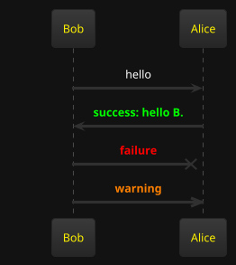
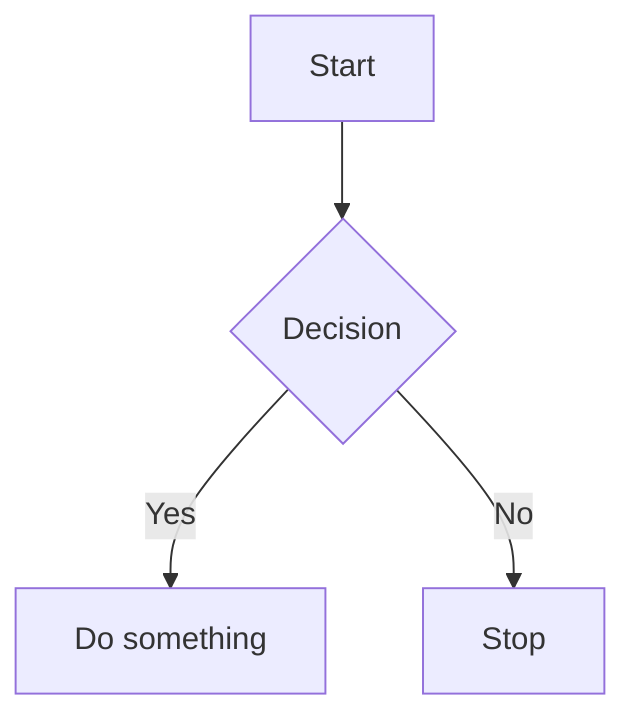

# Developer Notes

The goal of this tool is to help developers build a personal knowledge base with markdown files in 
a corporate environment.

By a corporate environment, I mean:

* You do not have access to personal knowledge base tools like Obsidian, Notion, etc.
* You have access to create a personal Git repository and store documents in it.
* You need to work with multiple databases with different schemas - trying to remember obscure table and column names is not enjoyable.
* You need a scripting language to gather data and display it in a user-friendly way.

## Requirements

* Java 17 or higher
* Maven
* Git

## Features

* Store documents as markdown files
* Save documents into a Git repository
* Execute Groovy scripts and render results in multiple formats:
   - CSV tables
   - HTML
   - Text
* Spaced-repetition flash cards for active recall of notes
* **Currency-symbol column conversion** in data blocks — columns named `$…`, `£…`, or `€…` automatically convert cell values to USD / GBP / EUR using configured exchange rates
* **Exchange Rate Manager** at `/tools/exchange-rates` — add and delete currency-pair rates that are persisted and used for live column conversion
* **Image Audit** at `/tools/image-audit` — scan the docs directory for orphaned image files and broken image links in markdown files
* **Todo blocks** — embed colour-coded task lists directly in markdown using `` ```todo `` fences; rows are coloured by the worst of independent age and due-in thresholds; `created` dates are filled in automatically on save

### Groovy Scripting

To embed executable Groovy code in a markdown file, use the following syntax:

#### To render the result as a CSV table with a header:
````
```groovy:csv-table-with-header
def output = ""
output += "N, N squared \n"
for (int i = 0; i < 10; i++) {
    output += "${i},${i * i}\n"
}

output
```
````


#### To render the result as a csv table:
````
```groovy:csv-table
def output = ""
for (int i = 0; i < 10; i++) {
    output += "${i},${i * i}\n"
}

output
```
````

#### To render the result as code block without any html formatting:
````
```groovy:code-block
def output = """
The following output will contain the angle brackets:

<h1>Hello World</h1>

output
```
````

#### To render the result as html:
````
```groovy:html
def output = "<h1>Hello World</h1>"

output
```
````

#### To render the result as text:
````
```groovy:text
def output = "Hello World"

output
```
````
The code will be executed and the result will be rendered in the markdown file.

### Playwright Scripting

To embed executable Playwright code in a markdown file, use the following syntax:

````
```groovy:text
import com.microsoft.playwright.Browser
import com.microsoft.playwright.Page
import com.microsoft.playwright.Playwright

def pageTitle = "Unable to get"

def env = ["PLAYWRIGHT_SKIP_BROWSER_DOWNLOAD":"1"]
try (Playwright playwright = Playwright.create(new Playwright.CreateOptions().setEnv(env))) {
    Browser browser = playwright.chromium().launch()
    Page page = browser.newPage()
    page.navigate("http://playwright.dev")
    pageTitle = page.title()
}
pageTitle
```
````

Another playwright example:

````
import com.microsoft.playwright.BrowserType
import com.microsoft.playwright.Playwright

def pageTitle = "Unable to get"

try (Playwright playwright = Playwright.create()) {
	// channel can be - "chrome" or "msedge"
	def browser = playwright.chromium().launch(new BrowserType.LaunchOptions().setChannel("chrome"))
	def page = browser.newPage()
	page.navigate("http://playwright.dev")
    pageTitle = page.title()
}
pageTitle
````

#### Groovy code optional configuration

To enable caching use the following syntax in the code block header:

```
groovy:csv-table-with-header(cacheEnabled:false)
```

### Sql Scripting

To embed executable sql code in a markdown file, use the following syntax:

````
```sql(datasource:datasource1, max_rows:100)
SELECT * FROM users
```
````

That gets rendered as: 


Following parameters can be specified in the code block header:

* datasource: Name of the SQL data source to use.
* max_rows: Maximum number of rows to return.

### Data blocks

Data blocks are a more advanced way to embed executable code in a Markdown file. They allow you to specify 
the data source, query, options, and output template.

Example:

````
```data
source: datasource1
query: SELECT id, first_name, last_name FROM users
options:
  columns: [id, first_name, last_name]
  limit: 10
output-template-type: jte
output-template: |
  @import java.util.*
  @param List<String>  columns
  @param List<Map<String, Object>> rows
  <table>
      <thead>
      <tr>
          @for(var column : columns)
              <th>${column}</th>
          @endfor
      </tr>
      </thead>
      <tbody>
      @for(var row : rows)
          <tr>
              @for(String column : columns)
                  <td>-${row.get(column) == null? "": row.get(column).toString()}</td>
              @endfor
          </tr>
      @endfor
      </tbody>
  </table>
```
````

#### Default without output-template

If no output-template is specified, the default will be an HTML table.

````
```data
source: datasource1
query: SELECT * FROM users
```
````

#### Column formatting

Use `column-formats` to control how individual columns are displayed. Each entry maps a column name
(matched case-insensitively against the JDBC result-set label) to a format config.

**Number formatting** uses [`java.text.DecimalFormat`](https://docs.oracle.com/en/java/docs/api/java.base/java/text/DecimalFormat.html)
pattern strings:

````
```data
source: datasource1
query: SELECT name, amount, rate FROM trades

column-formats:
  amount:
    number-format: "#,##0.00"      # e.g.  1,234,567.89
  rate:
    number-format: "0.00000"       # e.g.  0.05678
```
````

Columns without a `column-formats` entry fall back to the built-in defaults:
- `BigDecimal`, `Double`, `Float` → `%,.2f` (two decimal places with thousands separator)
- Integer/long types → plain `toString()`

| Key | Type | Description |
|---|---|---|
| `column-formats.<col>.number-format` | `DecimalFormat` pattern | Format applied to any `Number` value in that column |

#### Currency-symbol column conversion

When a SQL result column name begins with a recognised currency symbol, every non-null cell value
is automatically converted to the corresponding target currency and displayed as a formatted
number.

| Column prefix | Unicode | Target currency | Example |
|---|---|---|---|
| `$` | U+0024 | USD | `$balance` |
| `£` | U+00A3 | GBP | `£nav` |
| `€` | U+20AC | EUR | `€revenue` |

**Cell wire format:** `CCC <number>` where `CCC` is an ISO 4217 code (e.g. `GBP 200`,
`EUR 1234.56`).  Negative amounts are supported.

Example — a column named `$balance` holding `GBP 200` will look up the GBP→USD rate and
display the converted value formatted with `#,##0.00` (or a custom `number-format` if
configured):

````
```data
source: datasource1
query: SELECT name, cast('GBP 200' as varchar) AS "$balance" FROM trades
column-formats:
  "$balance":
    number-format: "#,##0.00"
```
````

**Rendering rules:**

| Situation | Result |
|---|---|
| Null / blank cell | `(null)` — no conversion |
| Malformed value (no space, unknown ISO code, non-numeric) | Red cell (`data-block-currency-error`) |
| Source currency = target currency | Formatted directly as a number — no rate lookup |
| Rate found | Converted and formatted; `data-block-number` CSS class |
| Rate not configured | Amber cell with tooltip (`data-block-no-rate`) |

Exchange rates are managed at **`/tools/exchange-rates`** and are persisted to
`<docsDirectory>/config/exchange-rates.yaml`.  Saving or deleting a rate automatically
invalidates any cached data-block output that involves a currency-symbol column.

#### Database Connection Details

The datasource details are defined in a yaml file under '/config/datasource.yaml'.

```yaml
---
datasource1:
  url: "jdbc:h2:tcp://localhost:4000/./testdb"
  username: "sa"
  password: ""
  driverClassName: "org.h2.Driver"
datasource2:
  url: "jdbc:postgresql://localhost:5432/db2"
  username: "user2"
  password: "pass2"
  driverClassName: "org.postgresql.Driver"
```

#### Encrypting datasource passwords

Passwords in `config/datasource.yaml` can be stored encrypted using **AES-256-GCM**.
The key is derived from a memorable passphrase you supply via the UI — it is held only in
JVM memory and is never written to disk.

**Activating encryption:**

1. Start the server and navigate to **`/config/encryption-key`**.
2. Enter a passphrase of at least 12 characters (e.g. `coffee-builds-faster-now`).
3. Click **Activate**. The server derives an AES-256 key via PBKDF2WithHmacSHA256
   (600 000 iterations) and immediately re-encrypts every datasource password.

After activation, passwords in `datasource.yaml` are stored as opaque tokens:

```yaml
datasource2:
  url: "jdbc:postgresql://localhost:5432/db2"
  username: "user2"
  password: "ENC(abc123…)"
  driverClassName: "org.postgresql.Driver"
```

**On every server restart** you must re-enter the passphrase at `/config/encryption-key`
before datasource connections can be established.  The `/config` page shows an amber
warning banner when no passphrase is active.

A random PBKDF2 salt is generated on first use and stored (non-secret) in
`config/encryption.salt` alongside `datasource.yaml`.  Back this file up together
with `datasource.yaml` — without it the passphrase alone is not enough to decrypt.

> Plain-text passwords in an existing `datasource.yaml` are read as-is if no
> passphrase has been set, so upgrading an existing installation requires no
> immediate migration.  They will be encrypted the first time you activate a
> passphrase.

### Database Metadata blocks

Database metadata blocks document a single database table — its columns, types, descriptions and
allowed values — directly inside a markdown file.

````
```database-metadata
table:
  name: instrument
  description: Store instruments used in trading.
  datasource: myDatasource        # optional — enables "Check against DB"
columns:
  name:
    oracle-type: varchar2(200)
    h2-type: varchar(200)
    java-type: java.lang.String
    description: Instrument name
  type:
    oracle-type: varchar2(20)
    h2-type: varchar(20)
    java-type: java.lang.String
    description: Instrument type
    values:
      PRP: Perpetual bond
      EQU: Equity
  created_at:
    oracle-type: date
    h2-type: timestamp
    java-type: java.time.LocalDateTime
    description: Record creation timestamp
```
````

The fence renders as a styled documentation card with a title bar and a columns table (Column /
Oracle Type / H2 Type / DB Type / Java Type / Description / Values).

#### Checking documentation against a live database

When the optional `table.datasource` key is set to a datasource name defined in
`config/datasource.yaml`, a **Check against DB ▶** button is appended to the card.
Clicking it sends the YAML to `POST /database-metadata/check`, which:

1. Opens a JDBC connection to the named datasource.
2. Calls `DatabaseMetaData.getColumns()` to discover the live schema.
3. Compares documented columns against live columns (case-insensitive).
4. Returns an inline diff fragment showing:
   - ✅ Columns that match
   - ⚠️ DB columns not yet documented in the wiki
   - 🚫 Documented columns no longer present in the DB

#### Column field reference

| Field | Required | Description |
|---|---|---|
| `table.name` | yes | Exact DB table name |
| `table.description` | no | Human-readable table description |
| `table.datasource` | no | Datasource key; enables the diff button |
| `columns.<name>.oracle-type` | no | Oracle DDL type, e.g. `varchar2(200)` |
| `columns.<name>.h2-type` | no | H2 DDL type, e.g. `varchar(200)` |
| `columns.<name>.db-type` | no | DDL type for all other databases (PostgreSQL, MySQL, …) |
| `columns.<name>.java-type` | no | Fully-qualified Java class |
| `columns.<name>.description` | no | Human-readable column description |
| `columns.<name>.values` | no | Map of allowed values to their meanings |

The three type fields (`oracle-type`, `h2-type`, `db-type`) are mutually exclusive — only the one
matching the target database is populated; the others are omitted.

#### Fetching metadata from a live database

The **Database Metadata Fetcher** tool at `/database` generates a ready-to-use Markdown file from
a live JDBC datasource. Navigate to `/database`, select a datasource, enter an output name, and
optionally scope the export with schema/table patterns.

`POST /database/fetch-metadata` parameters:

| Parameter | Required | Description |
|---|---|---|
| `configName` | yes | Datasource key from `config/datasource.yaml` |
| `targetName` | yes | Output filename stem — written to `<docsDirectory>/database/<targetName>.md` |
| `schemaPattern` | no | JDBC schema pattern (e.g. `PUBLIC`); defaults to all schemas |
| `tablePattern` | no | JDBC table-name pattern (e.g. `ORD%`); defaults to `%` |

The output file contains one `` ```database-metadata `` block per table, sorted alphabetically
and separated by a blank line. Column names are lowercased. The type field written depends on the
database product:

| DB product | Type field written |
|---|---|
| H2 | `h2-type` |
| Oracle | `oracle-type` |
| Any other (PostgreSQL, MySQL, …) | `db-type` |

After generation, open the file in your wiki, fill in the `description` placeholders, and add
`values` maps for enum-like columns. The `table.datasource` key is pre-populated so the
**Check against DB ▶** button works immediately.

### Todo blocks

Embed a colour-coded task list directly in a markdown file using a `` ```todo `` fenced code
block.  The block body is YAML.

````
```todo
thresholds:              # optional — these are the defaults
  age:
    green:  7            # days open — green/amber boundary
    amber: 14            # days open — amber/red boundary
    red:   30            # days open — red/overdue boundary
  due-in:
    green: 30            # days left — amber/green boundary
    amber: 14            # days left — red/amber boundary
    red:    7            # days left — overdue/red boundary
items:
  - summary: Fix login bug
    created: 2026-03-01
    due: 2026-04-01
    description: |
      See ticket **#1234**. Steps to reproduce…
  - summary: Update docs
    created: 2026-03-20
```
````

The fence renders as a styled HTML table with four columns: **Summary / Open (days) / Due in /
Description**.

- **Open (days)** — number of days since `created` (`—` when absent).
- **Due in** — days until `due`; negative means overdue (`—` when absent).

#### Colour coding

Both age and due-in are evaluated independently for every item.  The **highest criticality**
of the two determines the row colour.

| CSS class | Age condition | Urgency condition |
|---|---|---|
| `todo-green` | Newer than `green` days | Due more than `green` days away |
| `todo-amber` | Between `green` and `amber` days old | Due between `amber` and `green` days away |
| `todo-red` | Between `amber` and `red` days old | Due between `red` and `amber` days away |
| `todo-overdue` | Older than `red` days | Past due, or due within `red` days |

Criticality ranking: `todo-overdue` > `todo-red` > `todo-amber` > `todo-green`.

Items without `created` default to green for the age dimension; items without `due` default to
green for the due-in dimension.

#### Field reference

| Field | Required | Type | Description |
|---|---|---|---|
| `thresholds.age.green` | no | int (days) | Age green/amber boundary; default `7` |
| `thresholds.age.amber` | no | int (days) | Age amber/red boundary; default `14` |
| `thresholds.age.red` | no | int (days) | Age red/overdue boundary; default `30` |
| `thresholds.due-in.green` | no | int (days) | Due-in amber/green boundary; default `30` |
| `thresholds.due-in.amber` | no | int (days) | Due-in red/amber boundary; default `14` |
| `thresholds.due-in.red` | no | int (days) | Due-in overdue/red boundary; default `7` |
| `items[].summary` | **yes** | string | One-line task description |
| `items[].created` | no | ISO date `yyyy-MM-dd` | Date the item was opened; drives the age colour dimension |
| `items[].due` | no | ISO date `yyyy-MM-dd` | Target completion date; drives the due-in colour dimension |
| `items[].description` | no | CommonMark markdown | Multi-line detail rendered as HTML in the table cell |


### Constructing dynamic URLs

To construct a dynamic URL, you can use the following code:


```html
Source: <input type="text" id="source" name="source"><br>
<a id="result" href="">link</a><br>
<script>
const source = document.getElementById('source');
const result = document.getElementById('result');

const inputHandler = function(e) {
  const link = "https://your-url.com/text_search_exact_match.do?search_term=" + e.target.value;
  result.href = link;
  result.innerText = link;
}

source.addEventListener('input', inputHandler);
</script>
```

### PlantUML
PlantUML diagrams can be rendered using calling the URL `/plantuml?filename=diagram.puml`.

Embedding plantuml diagrams in Markdown files is supported using the following syntax:
````

````

### Mermaid support

````

````
Should render: 


### Javascript support

Javascript script tags can be embedded in markdown files using the following syntax:

```html
<script src="/javascript?filename=script.js">
</script>
```

If the filename starts with dot (e.g. `./script.js`) the file will be searched in the 
same directory as the markdown file.

### Flash Cards

Flash cards let you turn any piece of knowledge into an active-recall exercise using the
**SM-2 spaced-repetition algorithm**.  Cards are stored as plain YAML files under
`<docsDirectory>/config/flashcards/`, so they are tracked in Git alongside your notes.

Navigate to **`/flashcards`** to see the summary dashboard.

#### Card storage

Each card is a YAML file.  The file's path within `config/flashcards/` defines its **topic**:
a card at `java/streams/lambda-basics.yaml` belongs to topic `java/streams`.

```yaml
question: |
  What is the type of a lambda that takes **two ints** and returns a `boolean`?
answer: |
  `BiPredicate<Integer, Integer>` — or any custom `@FunctionalInterface`.

  - Use `Predicate<T>` for one argument
  - Use `BiPredicate<T,U>` for two arguments
lastReviewed: "2026-03-28T14:05:00"
nextReview:   "2026-04-03T14:05:00"
reviewCount:   5
correctCount:  4
incorrectCount: 1
easeFactor:    2.36
interval:      6
```

Both `question` and `answer` are rendered as **CommonMark markdown** at review time, so code
fences, bold/italic, bullet lists, and inline code all work.  New cards created through the UI
need no pre-existing SM-2 fields — all scheduling fields default to their initial values.

#### Reviewing cards

Start a review session at `GET /flashcards/review` (all topics) or
`GET /flashcards/review?topic=java/streams` (single topic).

- The **question** is shown immediately.
- Click **Show Answer** (or press **Space**) to reveal the answer.
- Rate your recall with one of six buttons or press the matching key **0–5**:

| Key | Label    | Meaning                              |
|-----|----------|--------------------------------------|
| 0   | Blackout | Complete blank — no memory at all    |
| 1   | Wrong    | Incorrect, remembered after seeing the answer |
| 2   | Forgot   | Incorrect but easy when shown        |
| 3   | Hard     | Correct with significant difficulty  |
| 4   | Good     | Correct after hesitation             |
| 5   | Easy     | Perfect, no hesitation               |

After rating, the SM-2 algorithm updates the card's ease factor and schedules the next review,
then the next due card is shown automatically.

#### Managing cards

| Action | URL |
|--------|-----|
| Summary / stats dashboard | `GET /flashcards` |
| Start review (all topics) | `GET /flashcards/review` |
| Start review (one topic)  | `GET /flashcards/review?topic=<topic>` |
| Create a new card         | `GET /flashcards/new` |
| Edit an existing card     | `GET /flashcards/edit/<encodedPath>` (link on review page) |

#### No migration required

Dropping plain YAML files (with only `question` and `answer`) into the `config/flashcards/`
directory is enough to create new cards.  Missing SM-2 fields default to
`easeFactor=2.5`, `interval=1`, and all counts to `0`.

### Exchange Rate Manager

Exchange rates are used by the [currency-symbol column conversion](#currency-symbol-column-conversion)
feature to convert cell values to a target currency at render time.

Navigate to **`/tools/exchange-rates`** to:

- View the current rate table (pair → rate, e.g. `GBP/USD: 1.2700`).
- Add or update a rate by entering a `BASE/QUOTE` pair (e.g. `GBP/USD`) and a positive decimal
  rate.
- Delete a rate with the trash-icon button on each row.

Rates are persisted to `<docsDirectory>/config/exchange-rates.yaml`:

```yaml
GBP/USD: 1.2700
EUR/USD: 1.0850
JPY/USD: 0.006800
```

**Cross-rates** are derived automatically — if `GBP/USD` and `EUR/USD` are both configured,
`GBP/EUR` is computed on the fly without an explicit entry.

**Cache invalidation** is automatic: saving or deleting any rate rewrites the YAML file, which
changes the cache checksum for every data block that contains a currency-symbol column.  The
next page render will re-execute the query with fresh rates.

### Image Audit

The **Image Audit** tool at **`/tools/image-audit`** scans the entire docs directory and reports
two kinds of housekeeping issues:

| Section | What it shows |
|---|---|
| **Orphaned Images** | Image files on disk that are not linked from any `.md` file |
| **Broken Image Links** | `` references in markdown files that point to a file that does not exist |

Navigate to `/tools/image-audit` to run the audit on demand.  There are no parameters — it
always scans the full `docsDirectory`.

#### Path resolution

| Link form | Interpreted as |
|---|---|
| `http://…` / `https://…` | External — ignored |
| `/path/to/img.png` | Absolute from the docs root — resolved as `<docsDirectory>/path/to/img.png` |
| `relative/img.png` | Relative to the markdown file's own directory |

#### Recognised image extensions

`.png`, `.jpg`, `.jpeg`, `.gif`, `.svg`, `.bmp`, `.webp`, `.tiff`, `.tif`, `.ico`

#### Results layout

- Each section has a count badge next to its heading.
- When no issues are found, a green check message is shown instead of a table.
- Orphaned image paths are sorted alphabetically (relative to `docsDirectory`).
- Broken links are sorted by markdown filename, then by image link.
- Each broken-link row links directly to the markdown file so you can open and fix it.

## Building and Running

To build the project, run the following command:

```
mvn clean package
```

To run the project, run the following command:

```
java -Ddevnotes.docsDirectory=/path/to/docs -jar target/devnotes-0.0.1-SNAPSHOT.jar prod
```

## Adding todo items

Use the `` ```todo `` fenced code block directly in any markdown file — see the
[Todo blocks](#todo-blocks) section above for the full YAML schema and colour-threshold reference.

When you save a markdown file, any todo item that is missing a `created` date is automatically
given today's date.

Additional tips can be found in the [todo-tip.md](docs/todo-tip.md) file.

## Workarounds 

### Script tags in Markdown files

The script tags in Markdown files may not find the dom elements or variables defined in other 
scripts in the page if they are executed before the page is fully loaded.

This is one way to work around this issue by looping until the variable is defined:

```html
<script>
  var tableUpdater; // define a variable that will be initialized later 
  (function loopUntilDefined() {
    let attemptCount = 0;
    const maxAttempts = 10;
    function tryLoop() {
      if (!tableUpdater) {
        attemptCount++;
        if (attemptCount >= maxAttempts) {
          console.error("Error: tableUpdater is still undefined after 10 attempts.");
          return;
        }
        setTimeout(tryLoop, 10);
        return;
      }
      tableUpdater();
    }
    tryLoop();
  })();
</script> 
```

## SSL Certificate config

To generate local SSL certificates for testing purposes, you can use the following command:

```
openssl req -nodes -x509 -sha256 -newkey rsa:4096 \
  -keyout tls/localtls.key \
  -out tls/localtls.crt \
  -days 365 \
  -subj "/C=GB/ST=London/L=London/O=Dev/OU=Lab/CN=localhost" \
  -addext 'subjectAltName = IP:192.168.1.103,DNS:localhost'
```

You may have to adjust the IP and DNS values in the subjectAltName extension to match your local setup.

Prefix `MSYS_NO_PATHCONV=1` to the command to avoid path conversion issues on Windows with Git Bash.


## License
This project is licensed under MIT license.

See the [LICENSE](LICENSE) file for details
