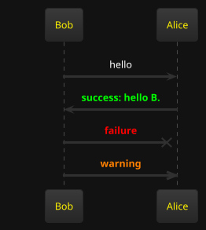

# Developer Notes

The goal of this tool is to help developers build personal knowledge base with markdown files in 
a corporate environment.

By a corporate environment, I mean 

* you have no access to personal knowledge base building tools like obsidian, notion, etc.
* you have access create a personal git repository and store documents in it
* you need to work with multiple databases with different schemas - trying to remember the obscure table and column names is not fun
* you need a scripting language to gather data and display it in a nice way

## Requirements

* Java 17 or higher
* Maven
* Git

## Features

* Store documents as markdown files
* Save the documents into a git repository
* Execute groovy scripts and render results in multiple formats
   - csv tables
   - html
   - text

### Groovy Scripting

To embed executable groovy code in a markdown file, use the following syntax:

#### To render the result as a csv table with header:
````
```groovy:csv-table-with-header
def outputString = ""
outputString += "N, N squared \n"
for (int i = 0; i < 10; i++) {
    outputString += "${i},${i * i}\n"
}

outputString
```
````


#### To render the result as a csv table:
````
```groovy:csv-table
def outputString = ""
for (int i = 0; i < 10; i++) {
    outputString += "${i},${i * i}\n"
}

outputString
```
````

#### To render the result as code block without any html formatting:
````
```groovy:code-block
def outputString = """
The following output will contain the angle brackets:

<h1>Hello World</h1>

outputString
```
````

#### To render the result as html:
````
```groovy:html
def outputString = "<h1>Hello World</h1>"

outputString
```
````

#### To render the result as text:
````
```groovy:text
def outputString = "Hello World"

outputString
```
````
The code will be executed and the result will be rendered in the markdown file.

### Playwright Scripting

To embed executable playwright code in a markdown file, use the following syntax:

````
```groovy:text
import com.microsoft.playwright.Browser
import com.microsoft.playwright.Page
import com.microsoft.playwright.Playwright

def pageTitle = "Unable to get"

def env = ["PLAYWRIGHT_SKIP_BROWSER_DOWNLOAD":"1"]
try (Playwright playwright = Playwright.create(new Playwright.CreateOptions().setEnv(env))) {
    Browser browser = playwright.chromium().launch()
    Page page = browser.newPage()
    page.navigate("http://playwright.dev")
    pageTitle = page.title()
}
pageTitle
```
````

Another playwright example:

````
import com.microsoft.playwright.BrowserType
import com.microsoft.playwright.Playwright

def pageTitle = "Unable to get"

try (Playwright playwright = Playwright.create()) {
		// channel can be - "chrome" or "msedge"
		def browser = playwright.chromium().launch(new BrowserType.LaunchOptions().setChannel("chrome"))
		def page = browser.newPage()
		page.navigate("http://playwright.dev")
    pageTitle = page.title()
}
pageTitle
````

#### Groovy code optional configuration

To enable caching use the following syntax in the code block header:

```
groovy:csv-table-with-header(cacheEnabled:false)
```

### Sql Scripting

To embed executable sql code in a markdown file, use the following syntax:

````
```sql(datasource:datasource1)
SELECT * FROM users
```
````

That gets rendered as: 


#### Database Connection Details

The datasource details are defined in a yaml file under '/config/datasource.yaml'.

```yaml
---
datasource1:
  url: "jdbc:h2:tcp://localhost:4000/./testdb"
  username: "sa"
  password: ""
  driverClassName: "org.h2.Driver"
datasource2:
  url: "jdbc:postgresql://localhost:5432/db2"
  username: "user2"
  password: "pass2"
  driverClassName: "org.postgresql.Driver"
```

### Building and Running

To build the project, run the following command:

```
mvn clean package
```

To run the project, run the following command:

```
java -Ddevnotes.docsDirectory=/path/to/docs -jar target/devnotes-0.0.1-SNAPSHOT.jar prod
```

### Constructing dynamic URLs

To construct a dynamic URL, you can use the following code:

```html
Source: <input type="text" id="source" name="source"><br>
<a id="result" href="">link</a><br>
<script>
const source = document.getElementById('source');
const result = document.getElementById('result');

const inputHandler = function(e) {
  const link = "https://your-url.com/text_search_exact_match.do?search_term=" + e.target.value;
  result.href = link;
  result.innerText = link;
}

source.addEventListener('input', inputHandler);
</script>
```

## PlantUML
PlantUML diagrams can be rendered using calling the URL `/plantuml?filename=diagram.puml`.

Embedding plantuml diagrams in markdown files is supported using the following syntax:
````

````

### Javascript support

Javascript script tags can be embedded in markdown files using the following syntax:

```html
<script src="//js?filename=script.js">
</script>
```

Note the doulbe slash before the filename.

if the filename starts with dot (e.g. `./script.js`) the file will be searched in the same directory as the markdown file.

### SQL support

SQL code blocks can be embedded in markdown files using the following syntax:

```sql(datasource:datasource1)
SELECT * FROM users
```

## License
This project is licensed under MIT license.

See the [LICENSE](LICENSE) file for details
