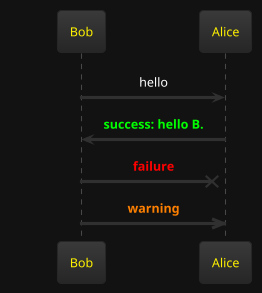

# Developer Notes

The goal of this tool is to help developers build a personal knowledge base with markdown files in 
a corporate environment.

By a corporate environment, I mean:

* You do not have access to personal knowledge base tools like Obsidian, Notion, etc.
* You have access to create a personal Git repository and store documents in it.
* You need to work with multiple databases with different schemas - trying to remember obscure table and column names is not enjoyable.
* You need a scripting language to gather data and display it in a user-friendly way.

## Requirements

* Java 17 or higher
* Maven
* Git

## Features

* Store documents as markdown files
* Save documents into a Git repository
* Execute Groovy scripts and render results in multiple formats:
   - CSV tables
   - HTML
   - Text

### Groovy Scripting

To embed executable Groovy code in a markdown file, use the following syntax:

#### To render the result as a CSV table with a header:
````
```groovy:csv-table-with-header
def output = ""
output += "N, N squared \n"
for (int i = 0; i < 10; i++) {
    output += "${i},${i * i}\n"
}

output
```
````


#### To render the result as a csv table:
````
```groovy:csv-table
def output = ""
for (int i = 0; i < 10; i++) {
    output += "${i},${i * i}\n"
}

output
```
````

#### To render the result as code block without any html formatting:
````
```groovy:code-block
def output = """
The following output will contain the angle brackets:

<h1>Hello World</h1>

output
```
````

#### To render the result as html:
````
```groovy:html
def output = "<h1>Hello World</h1>"

output
```
````

#### To render the result as text:
````
```groovy:text
def output = "Hello World"

output
```
````
The code will be executed and the result will be rendered in the markdown file.

### Playwright Scripting

To embed executable Playwright code in a markdown file, use the following syntax:

````
```groovy:text
import com.microsoft.playwright.Browser
import com.microsoft.playwright.Page
import com.microsoft.playwright.Playwright

def pageTitle = "Unable to get"

def env = ["PLAYWRIGHT_SKIP_BROWSER_DOWNLOAD":"1"]
try (Playwright playwright = Playwright.create(new Playwright.CreateOptions().setEnv(env))) {
    Browser browser = playwright.chromium().launch()
    Page page = browser.newPage()
    page.navigate("http://playwright.dev")
    pageTitle = page.title()
}
pageTitle
```
````

Another playwright example:

````
import com.microsoft.playwright.BrowserType
import com.microsoft.playwright.Playwright

def pageTitle = "Unable to get"

try (Playwright playwright = Playwright.create()) {
	// channel can be - "chrome" or "msedge"
	def browser = playwright.chromium().launch(new BrowserType.LaunchOptions().setChannel("chrome"))
	def page = browser.newPage()
	page.navigate("http://playwright.dev")
    pageTitle = page.title()
}
pageTitle
````

#### Groovy code optional configuration

To enable caching use the following syntax in the code block header:

```
groovy:csv-table-with-header(cacheEnabled:false)
```

### Sql Scripting

To embed executable sql code in a markdown file, use the following syntax:

````
```sql(datasource:datasource1, max_rows:100)
SELECT * FROM users
```
````

That gets rendered as: 


Following parameters can be specified in the code block header:

* datasource: Name of the SQL data source to use.
* max_rows: Maximum number of rows to return.

### Data blocks

Data blocks are a more advanced way to embed executable code in a Markdown file. They allow you to specify 
the data source, query, options, and output template.

Example:

````
```data
source: datasource1
query: SELECT id, first_name, last_name FROM users
options:
  columns: [id, first_name, last_name]
  limit: 10
output-template-type: jte
output-template: |
  @import java.util.*
  @param List<String>  columns
  @param List<Map<String, Object>> rows
  <table>
      <thead>
      <tr>
          @for(var column : columns)
              <th>${column}</th>
          @endfor
      </tr>
      </thead>
      <tbody>
      @for(var row : rows)
          <tr>
              @for(String column : columns)
                  <td>-${row.get(column) == null? "": row.get(column).toString()}</td>
              @endfor
          </tr>
      @endfor
      </tbody>
  </table>
```
````

#### Default without output-template

If no output-template is specified, the default will be an HTML table.

````
```data
source: datasource1
query: SELECT * FROM users
```
````

#### Database Connection Details

The datasource details are defined in a yaml file under '/config/datasource.yaml'.

```yaml
---
datasource1:
  url: "jdbc:h2:tcp://localhost:4000/./testdb"
  username: "sa"
  password: ""
  driverClassName: "org.h2.Driver"
datasource2:
  url: "jdbc:postgresql://localhost:5432/db2"
  username: "user2"
  password: "pass2"
  driverClassName: "org.postgresql.Driver"
```

### Constructing dynamic URLs

To construct a dynamic URL, you can use the following code:

```html
Source: <input type="text" id="source" name="source"><br>
<a id="result" href="">link</a><br>
<script>
const source = document.getElementById('source');
const result = document.getElementById('result');

const inputHandler = function(e) {
  const link = "https://your-url.com/text_search_exact_match.do?search_term=" + e.target.value;
  result.href = link;
  result.innerText = link;
}

source.addEventListener('input', inputHandler);
</script>
```

### PlantUML
PlantUML diagrams can be rendered using calling the URL `/plantuml?filename=diagram.puml`.

Embedding plantuml diagrams in Markdown files is supported using the following syntax:
````

````

### Javascript support

Javascript script tags can be embedded in markdown files using the following syntax:

```html
<script src="/javascript?filename=script.js">
</script>
```

If the filename starts with dot (e.g. `./script.js`) the file will be searched in the 
same directory as the markdown file.

## Building and Running

To build the project, run the following command:

```
mvn clean package
```

To run the project, run the following command:

```
java -Ddevnotes.docsDirectory=/path/to/docs -jar target/devnotes-0.0.1-SNAPSHOT.jar prod
```

## Adding todo items

Tips can be found in the [todo-tip.md](docs/todo-tip.md) file.

## Workarounds 

### Script tags in Markdown files

The script tags in Markdown files may not find the dom elements or variables defined in other 
scripts in the page if they are executed before the page is fully loaded.

This is one way to work around this issue by looping until the variable is defined:

```html
<script>
  var tableUpdater; // define a variable that will be initialized later 
  (function loopUntilDefined() {
    let attemptCount = 0;
    const maxAttempts = 10;
    function tryLoop() {
      if (!tableUpdater) {
        attemptCount++;
        if (attemptCount >= maxAttempts) {
          console.error("Error: tableUpdater is still undefined after 10 attempts.");
          return;
        }
        setTimeout(tryLoop, 10);
        return;
      }
      tableUpdater();
    }
    tryLoop();
  })();
</script> 
```

## License
This project is licensed under MIT license.

See the [LICENSE](LICENSE) file for details
