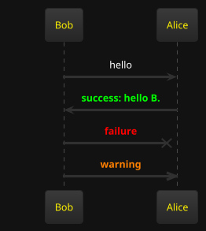
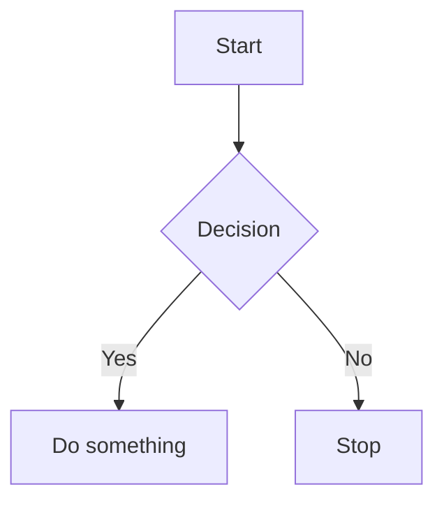

# Developer Notes

The goal of this tool is to help developers build a personal knowledge base with markdown files in 
a corporate environment.

By a corporate environment, I mean:

* You do not have access to personal knowledge base tools like Obsidian, Notion, etc.
* You have access to create a personal Git repository and store documents in it.
* You need to work with multiple databases with different schemas - trying to remember obscure table and column names is not enjoyable.
* You need a scripting language to gather data and display it in a user-friendly way.

## Requirements

* Java 17 or higher
* Maven
* Git

## Features

* Store documents as markdown files
* Save documents into a Git repository
* Execute Groovy scripts and render results in multiple formats:
   - CSV tables
   - HTML
   - Text

### Groovy Scripting

To embed executable Groovy code in a markdown file, use the following syntax:

#### To render the result as a CSV table with a header:
````
```groovy:csv-table-with-header
def output = ""
output += "N, N squared \n"
for (int i = 0; i < 10; i++) {
    output += "${i},${i * i}\n"
}

output
```
````


#### To render the result as a csv table:
````
```groovy:csv-table
def output = ""
for (int i = 0; i < 10; i++) {
    output += "${i},${i * i}\n"
}

output
```
````

#### To render the result as code block without any html formatting:
````
```groovy:code-block
def output = """
The following output will contain the angle brackets:

<h1>Hello World</h1>

output
```
````

#### To render the result as html:
````
```groovy:html
def output = "<h1>Hello World</h1>"

output
```
````

#### To render the result as text:
````
```groovy:text
def output = "Hello World"

output
```
````
The code will be executed and the result will be rendered in the markdown file.

### Playwright Scripting

To embed executable Playwright code in a markdown file, use the following syntax:

````
```groovy:text
import com.microsoft.playwright.Browser
import com.microsoft.playwright.Page
import com.microsoft.playwright.Playwright

def pageTitle = "Unable to get"

def env = ["PLAYWRIGHT_SKIP_BROWSER_DOWNLOAD":"1"]
try (Playwright playwright = Playwright.create(new Playwright.CreateOptions().setEnv(env))) {
    Browser browser = playwright.chromium().launch()
    Page page = browser.newPage()
    page.navigate("http://playwright.dev")
    pageTitle = page.title()
}
pageTitle
```
````

Another playwright example:

````
import com.microsoft.playwright.BrowserType
import com.microsoft.playwright.Playwright

def pageTitle = "Unable to get"

try (Playwright playwright = Playwright.create()) {
	// channel can be - "chrome" or "msedge"
	def browser = playwright.chromium().launch(new BrowserType.LaunchOptions().setChannel("chrome"))
	def page = browser.newPage()
	page.navigate("http://playwright.dev")
    pageTitle = page.title()
}
pageTitle
````

#### Groovy code optional configuration

To enable caching use the following syntax in the code block header:

```
groovy:csv-table-with-header(cacheEnabled:false)
```

### Sql Scripting

To embed executable sql code in a markdown file, use the following syntax:

````
```sql(datasource:datasource1, max_rows:100)
SELECT * FROM users
```
````

That gets rendered as: 


Following parameters can be specified in the code block header:

* datasource: Name of the SQL data source to use.
* max_rows: Maximum number of rows to return.

### Data blocks

Data blocks are a more advanced way to embed executable code in a Markdown file. They allow you to specify 
the data source, query, options, and output template.

Example:

````
```data
source: datasource1
query: SELECT id, first_name, last_name FROM users
options:
  columns: [id, first_name, last_name]
  limit: 10
output-template-type: jte
output-template: |
  @import java.util.*
  @param List<String>  columns
  @param List<Map<String, Object>> rows
  <table>
      <thead>
      <tr>
          @for(var column : columns)
              <th>${column}</th>
          @endfor
      </tr>
      </thead>
      <tbody>
      @for(var row : rows)
          <tr>
              @for(String column : columns)
                  <td>-${row.get(column) == null? "": row.get(column).toString()}</td>
              @endfor
          </tr>
      @endfor
      </tbody>
  </table>
```
````

#### Default without output-template

If no output-template is specified, the default will be an HTML table.

````
```data
source: datasource1
query: SELECT * FROM users
```
````

#### Column formatting

Use `column-formats` to control how individual columns are displayed. Each entry maps a column name
(matched case-insensitively against the JDBC result-set label) to a format config.

**Number formatting** uses [`java.text.DecimalFormat`](https://docs.oracle.com/en/java/docs/api/java.base/java/text/DecimalFormat.html)
pattern strings:

````
```data
source: datasource1
query: SELECT name, amount, rate FROM trades

column-formats:
  amount:
    number-format: "#,##0.00"      # e.g.  1,234,567.89
  rate:
    number-format: "0.00000"       # e.g.  0.05678
```
````

Columns without a `column-formats` entry fall back to the built-in defaults:
- `BigDecimal`, `Double`, `Float` → `%,.2f` (two decimal places with thousands separator)
- Integer/long types → plain `toString()`

| Key | Type | Description |
|---|---|---|
| `column-formats.<col>.number-format` | `DecimalFormat` pattern | Format applied to any `Number` value in that column |

#### Database Connection Details

The datasource details are defined in a yaml file under '/config/datasource.yaml'.

```yaml
---
datasource1:
  url: "jdbc:h2:tcp://localhost:4000/./testdb"
  username: "sa"
  password: ""
  driverClassName: "org.h2.Driver"
datasource2:
  url: "jdbc:postgresql://localhost:5432/db2"
  username: "user2"
  password: "pass2"
  driverClassName: "org.postgresql.Driver"
```

### Database Metadata blocks

Database metadata blocks document a single database table — its columns, types, descriptions and
allowed values — directly inside a markdown file.

````
```database-metadata
table:
  name: instrument
  description: Store instruments used in trading.
  datasource: myDatasource        # optional — enables "Check against DB"
columns:
  name:
    oracle-type: varchar2(200)
    h2-type: varchar(200)
    java-type: java.lang.String
    description: Instrument name
  type:
    oracle-type: varchar2(20)
    h2-type: varchar(20)
    java-type: java.lang.String
    description: Instrument type
    values:
      PRP: Perpetual bond
      EQU: Equity
  created_at:
    oracle-type: date
    h2-type: timestamp
    java-type: java.time.LocalDateTime
    description: Record creation timestamp
```
````

The fence renders as a styled documentation card with a title bar and a columns table (Column /
Oracle Type / H2 Type / DB Type / Java Type / Description / Values).

#### Checking documentation against a live database

When the optional `table.datasource` key is set to a datasource name defined in
`config/datasource.yaml`, a **Check against DB ▶** button is appended to the card.
Clicking it sends the YAML to `POST /database-metadata/check`, which:

1. Opens a JDBC connection to the named datasource.
2. Calls `DatabaseMetaData.getColumns()` to discover the live schema.
3. Compares documented columns against live columns (case-insensitive).
4. Returns an inline diff fragment showing:
   - ✅ Columns that match
   - ⚠️ DB columns not yet documented in the wiki
   - 🚫 Documented columns no longer present in the DB

#### Column field reference

| Field | Required | Description |
|---|---|---|
| `table.name` | yes | Exact DB table name |
| `table.description` | no | Human-readable table description |
| `table.datasource` | no | Datasource key; enables the diff button |
| `columns.<name>.oracle-type` | no | Oracle DDL type, e.g. `varchar2(200)` |
| `columns.<name>.h2-type` | no | H2 DDL type, e.g. `varchar(200)` |
| `columns.<name>.db-type` | no | DDL type for all other databases (PostgreSQL, MySQL, …) |
| `columns.<name>.java-type` | no | Fully-qualified Java class |
| `columns.<name>.description` | no | Human-readable column description |
| `columns.<name>.values` | no | Map of allowed values to their meanings |

The three type fields (`oracle-type`, `h2-type`, `db-type`) are mutually exclusive — only the one
matching the target database is populated; the others are omitted.

#### Fetching metadata from a live database

The **Database Metadata Fetcher** tool at `/database` generates a ready-to-use Markdown file from
a live JDBC datasource. Navigate to `/database`, select a datasource, enter an output name, and
optionally scope the export with schema/table patterns.

`POST /database/fetch-metadata` parameters:

| Parameter | Required | Description |
|---|---|---|
| `configName` | yes | Datasource key from `config/datasource.yaml` |
| `targetName` | yes | Output filename stem — written to `<docsDirectory>/database/<targetName>.md` |
| `schemaPattern` | no | JDBC schema pattern (e.g. `PUBLIC`); defaults to all schemas |
| `tablePattern` | no | JDBC table-name pattern (e.g. `ORD%`); defaults to `%` |

The output file contains one `` ```database-metadata `` block per table, sorted alphabetically
and separated by a blank line. Column names are lowercased. The type field written depends on the
database product:

| DB product | Type field written |
|---|---|
| H2 | `h2-type` |
| Oracle | `oracle-type` |
| Any other (PostgreSQL, MySQL, …) | `db-type` |

After generation, open the file in your wiki, fill in the `description` placeholders, and add
`values` maps for enum-like columns. The `table.datasource` key is pre-populated so the
**Check against DB ▶** button works immediately.

### Constructing dynamic URLs

To construct a dynamic URL, you can use the following code:


```html
Source: <input type="text" id="source" name="source"><br>
<a id="result" href="">link</a><br>
<script>
const source = document.getElementById('source');
const result = document.getElementById('result');

const inputHandler = function(e) {
  const link = "https://your-url.com/text_search_exact_match.do?search_term=" + e.target.value;
  result.href = link;
  result.innerText = link;
}

source.addEventListener('input', inputHandler);
</script>
```

### PlantUML
PlantUML diagrams can be rendered using calling the URL `/plantuml?filename=diagram.puml`.

Embedding plantuml diagrams in Markdown files is supported using the following syntax:
````

````

### Mermaid support

````

````
Should render: 


### Javascript support

Javascript script tags can be embedded in markdown files using the following syntax:

```html
<script src="/javascript?filename=script.js">
</script>
```

If the filename starts with dot (e.g. `./script.js`) the file will be searched in the 
same directory as the markdown file.

## Building and Running

To build the project, run the following command:

```
mvn clean package
```

To run the project, run the following command:

```
java -Ddevnotes.docsDirectory=/path/to/docs -jar target/devnotes-0.0.1-SNAPSHOT.jar prod
```

## Adding todo items

Tips can be found in the [todo-tip.md](docs/todo-tip.md) file.

## Workarounds 

### Script tags in Markdown files

The script tags in Markdown files may not find the dom elements or variables defined in other 
scripts in the page if they are executed before the page is fully loaded.

This is one way to work around this issue by looping until the variable is defined:

```html
<script>
  var tableUpdater; // define a variable that will be initialized later 
  (function loopUntilDefined() {
    let attemptCount = 0;
    const maxAttempts = 10;
    function tryLoop() {
      if (!tableUpdater) {
        attemptCount++;
        if (attemptCount >= maxAttempts) {
          console.error("Error: tableUpdater is still undefined after 10 attempts.");
          return;
        }
        setTimeout(tryLoop, 10);
        return;
      }
      tableUpdater();
    }
    tryLoop();
  })();
</script> 
```

## SSL Certificate config

To generate local SSL certificates for testing purposes, you can use the following command:

```
openssl req -nodes -x509 -sha256 -newkey rsa:4096 \
  -keyout tls/localtls.key \
  -out tls/localtls.crt \
  -days 365 \
  -subj "/C=GB/ST=London/L=London/O=Dev/OU=Lab/CN=localhost" \
  -addext 'subjectAltName = IP:192.168.1.103,DNS:localhost'
```

You may have to adjust the IP and DNS values in the subjectAltName extension to match your local setup.

Prefix `MSYS_NO_PATHCONV=1` to the command to avoid path conversion issues on Windows with Git Bash.


## License
This project is licensed under MIT license.

See the [LICENSE](LICENSE) file for details
