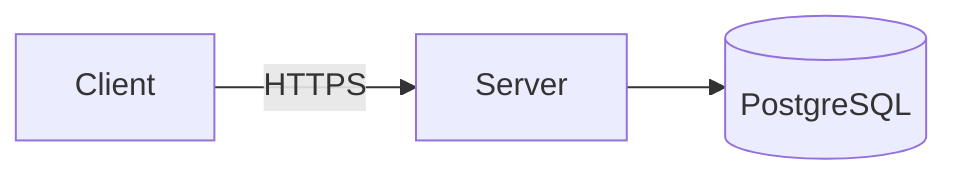
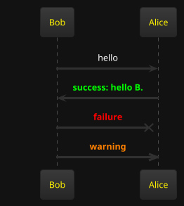
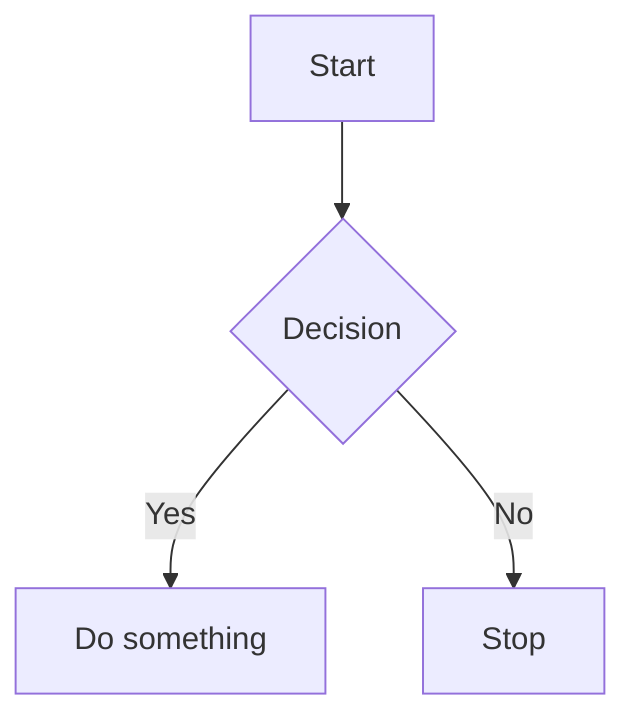

# Developer Notes

This is my personal wiki for jotting down notes, code snippets, and documentation related to my projects. It is built
with Java Spring Boot, and uses a custom Markdown parser to support executable Groovy and SQL blocks, database metadata
documentation, and other dynamic features.

* It uses Markdown files stored in a Git repository, so your notes are portable, searchable, and version-controlled.
* It can work with multiple databases with different schemas.
* It can do dynamic HTML fragment generation using Groovy.

## Requirements

* Java 17 or higher
* Maven
* Git

## Features

* Store documents as Markdown files
* Save documents into a Git repository
* Execute Groovy scripts and render results in multiple formats:
    - CSV tables
    - HTML
    - Text
    - Block config via a **YAML header** inside the fence (preferred) or the legacy
      `groovy:format(key:value)` info-string syntax; options include `output`, `cache-enabled`,
      and `controls-enabled` (default `true` — set to `false` to hide the ⋮ context menu)
* **Groovy Playground** at `/groovy-playground` - interactive split-pane editor with live execution and render-mode
  selector
* **Mermaid Playground** at `/mermaid-playground` - interactive split-pane editor with live Mermaid diagram preview
* Spaced-repetition flash cards for active recall of notes
* **Currency-symbol column conversion** in data blocks - columns named `$...`, `£...`, or `€...` automatically convert cell
  values to USD / GBP / EUR using configured exchange rates
* **Exchange Rate Manager** at `/tools/exchange-rates` - add, delete, and bulk-import currency-pair rates (via CSV
  upload) that are persisted and used for live column conversion
* **Image Audit** at `/tools/image-audit` - scan the docs directory for orphaned image files and broken image links in
  markdown files
* **Todo blocks** - embed colour-coded task lists directly in markdown using `` ```todo `` fences; rows are coloured by
  the worst of independent age and due-in thresholds; `created` dates are filled in automatically on save
* **REST blocks** - call any HTTP endpoint from a `` ```rest `` fence; extract results with JSONPath; render as an HTML
  table (with nested tables for nested objects/arrays); results are cached to disk and refreshable via a context menu
* **Inline Groovy expressions** - evaluate a Groovy expression inside any paragraph, heading, or bold/italic text using
  `[groovy]expression[/groovy]`; errors render as a ⚠ warning span
* **Inline red text** - highlight a span of text in red using `[red]text[/red]`
* **YAML front-matter** - add a `---` delimited YAML block at the top of any `.md` file to set a custom page `title`,
  tag badges, and a short `description` displayed below the tags
* **Slides / Presentation mode** - set `type: slides` in front-matter to render a markdown file as a full-screen browser
  slide deck; supports explicit `---` slide breaks, automatic heading-divider splitting, per-slide metadata, speaker
  notes, themes, and keyboard navigation
* **Exclusive edit locking** - opening a file for editing takes a server-side exclusive lock so the same file cannot be
  edited simultaneously from another window or tab; the lock is kept alive by automatic heartbeats and expires after
  60 seconds of inactivity; a **Force Edit** option lets you take over an apparently abandoned session

### Groovy Scripting

To embed executable Groovy code in a markdown file, use a `groovy` fenced code block. The body
starts with a **YAML header** that configures the block, followed by `---` on its own line, and
then the Groovy script.

#### To render the result as a CSV table with a header:

````
```groovy
output: csv-table-with-header
---
def output = ""
output += "N, N squared \n"
for (int i = 0; i < 10; i++) {
    output += "${i},${i * i}\n"
}

output
```
````


#### To render the result as a csv table:

````
```groovy
output: csv-table
---
def output = ""
for (int i = 0; i < 10; i++) {
    output += "${i},${i * i}\n"
}

output
```
````

#### To render the result as code block without any html formatting:

````
```groovy
output: code-block
---
def output = """
The following output will contain the angle brackets:

<h1>Hello World</h1>
"""
output
```
````

#### To render the result as html:

````
```groovy
output: html
---
def output = "<h1>Hello World</h1>"

output
```
````

#### To render the result as text:

````
```groovy
output: text
---
def output = "Hello World"

output
```
````

The code will be executed and the result will be rendered in the Markdown file.

### Playwright Scripting

To embed executable Playwright code in a Markdown file, use the following syntax:

````
```groovy
output: text
---
import com.microsoft.playwright.Browser
import com.microsoft.playwright.Page
import com.microsoft.playwright.Playwright

def pageTitle = "Unable to get"

def env = ["PLAYWRIGHT_SKIP_BROWSER_DOWNLOAD":"1"]
try (Playwright playwright = Playwright.create(new Playwright.CreateOptions().setEnv(env))) {
    Browser browser = playwright.chromium().launch()
    Page page = browser.newPage()
    page.navigate("http://playwright.dev")
    pageTitle = page.title()
}
pageTitle
```
````

Another playwright example:

````
import com.microsoft.playwright.BrowserType
import com.microsoft.playwright.Playwright

def pageTitle = "Unable to get"

try (Playwright playwright = Playwright.create()) {
	// channel can be - "chrome" or "msedge"
	def browser = playwright.chromium().launch(new BrowserType.LaunchOptions().setChannel("chrome"))
	def page = browser.newPage()
	page.navigate("http://playwright.dev")
    pageTitle = page.title()
}
pageTitle
````

#### Groovy block configuration

Configuration sits in the **YAML header** at the top of the block body, before the `---`
separator:

````
```groovy
output: html
cache-enabled: false
controls-enabled: false
---
"<p>My script</p>"
```
````

| Field              | Values                                                                  | Default | Description                                                                                         |
|--------------------|-------------------------------------------------------------------------|---------|-----------------------------------------------------------------------------------------------------|
| `output`           | `html` / `text` / `code-block` / `csv-table` / `csv-table-with-header` | `html`  | How the script's return value is rendered.                                                          |
| `cache-enabled`    | `true` / `false`                                                        | `true`  | When `false` the script is re-executed on every page render and no `.output` cache file is written. |
| `controls-enabled` | `true` / `false`                                                        | `true`  | When `false` the **⋮** context menu button is not injected into the rendered block.                 |

If the `---` separator is omitted, the entire body is treated as a Groovy script and `output`
defaults to `html`.


#### Groovy block context menu

Every rendered groovy block has a **⋮** button in the top-right corner (unless
`controls-enabled: false` is set in the YAML header). Clicking it opens a two-item menu:

* **Refresh** - re-executes the script (bypasses cache) and replaces the block output in-place.
* **Source** - toggles the visibility of the original Groovy source code.

To permanently hide the ⋮ button for a block that should appear as plain content, set
`controls-enabled: false` in the YAML header:

````
```groovy
output: html
controls-enabled: false
---
"<p>This output has no context menu.</p>"
```
````

### Groovy Playground

The **Groovy Playground** at `/groovy-playground` is a browser-based split-pane editor for
writing and executing Groovy scripts with a live rendered output panel.

At the top of the editor panel is a **render-mode** combo box with the same options as fenced
code blocks:

| Mode                    | Output                          |
|-------------------------|---------------------------------|
| `text`                  | `<pre>` block                   |
| `html`                  | Raw HTML                        |
| `code-block`            | Escaped `<pre>` block           |
| `csv-table`             | HTML table (no header row)      |
| `csv-table-with-header` | HTML table (first row = header) |

Features:

- **Live preview** - the script re-executes automatically as you type (debounced 800 ms).
- **Ctrl+Enter** - triggers an immediate run without waiting for the debounce.
- **Render mode** - the selected mode is remembered across sessions (browser `localStorage` and
  server-side `config/groovy-playground/last-render-mode.txt`).
- **Save / Save as...** - persist the script to any `.groovy` file within your docs directory.
- **Reset** - restore the editor to the built-in sample script.
- **Error handling** - execution errors are shown inline in the output panel; the server never
  returns a 5xx for a Groovy error.

The script and render mode are autosaved to `<docsDirectory>/config/groovy-playground/` on every
keystroke so your work is never lost.

### Inline Groovy expressions

Any paragraph, heading, list item, or bold/italic run can contain a `[groovy]...[/groovy]` tag.
The content between the tags is executed as a Groovy expression and its `toString()` result is
injected inline:

```markdown
Today is [groovy]LocalDate.now()[/groovy].

Report version [groovy]2 * 3[/groovy].

**Balance: [groovy]1_000_000 * 1.05[/groovy] USD**
```

The same built-in classes that are available in fenced Groovy blocks are available here
(`LocalDate`, `LocalDateTime`, etc.).

- **Success** - the result is rendered in a `<span class="groovy-inline">`.
- **Error** - a `<span class="groovy-inline-error">` with a ⚠ icon is shown; the full error
  message is in the `title` attribute so hovering reveals it.
- **Null result** - renders as an empty span (no visible output).
- **Backtick code spans** - content inside `` `...` `` is never evaluated; it is rendered as
  literal text.
- **Unclosed tag** - if `[groovy]` has no matching `[/groovy]`, the tag is left as plain text.

### Inline text highlighting

Wrap any run of text in `[red]...[/red]` to render it as a red `<span>`:

```markdown
This is [red]very important[/red] information.
```

The span receives the CSS class `color-red`, which is defined in `static/css/style.css`.

### YAML front-matter

Any Markdown file can begin with a YAML front-matter block delimited by `---` lines.
The block is stripped from the rendered output and its fields are used to annotate the page.

```markdown
---
title: My Great Page
description: A concise overview of the topic.
tags:
  - java
  - spring
---

# Content starts here
```

#### Supported fields

| Field         | Type                     | Effect                                                                                      |
|---------------|--------------------------|---------------------------------------------------------------------------------------------|
| `title`       | string                   | Overrides the browser `<title>` tag and the page heading shown in the tab                   |
| `description` | string                   | Displayed as an italic summary line below the tag badges                                    |
| `tags`        | list of strings          | Rendered as teal pill badges above the page content                                         |
| `type`        | string (default: `wiki`) | Page type; defaults to `wiki`; available for conditional rendering or future feature gating |

Any other YAML keys are accepted without error and stored in the `extra` map for future use.

#### Rendering

When at least one field is present, a `<div class="fm-metadata">` block is injected at the top
of the Markdown viewer, before the document body:

- **Tags** appear as `<span class="fm-tag">` elements in a flex row.
- **Description** appears as a `<p class="fm-description">` in italic, muted text.
- If no known fields are populated, the metadata div is omitted entirely.

The `title` field also controls the shell `<title>` element, which is computed when the outer
page HTML is first served (before the HTMX viewer swap). Files without front-matter continue
to use the filename-derived title.

### Slides / Presentation mode

Set `type: slides` in YAML front-matter to render a markdown file as a full-screen, keyboard-navigable
browser slide deck.

#### Canonical example

```markdown
---
type: slides
title: Distributed Systems Notes
theme: default
paginate: true
headingDivider: 2
---

# Distributed Systems

A practical overview.

---
layout: center
background: dark
notes: Explain why failure is the default assumption.
---

## Fault tolerance

- Partial failure is normal
- Timeouts are ambiguous
- Retries need idempotency

note:
Mention TCP vs application-level retry behavior.
```

#### Deck-level front-matter fields

| Field            | Type            | Description                                                                   |
|------------------|-----------------|-------------------------------------------------------------------------------|
| `type`           | `slides`        | **Required.** Activates presentation mode.                                    |
| `title`          | string          | Page `<title>` tag and browser tab label.                                     |
| `theme`          | string          | CSS `data-theme` attribute on the deck wrapper (`default`, `dark`, `light`).  |
| `paginate`       | `true`/`false`  | Show a page-number counter on each slide (default `false`).                   |
| `headingDivider` | integer or list | Heading level(s) that automatically start a new slide (e.g. `2` or `[2, 3]`). |
| `background`     | string          | Default background colour or image URL for all slides.                        |
| `class`          | string          | Default CSS class added to every slide `<section>`.                           |
| `lang`           | string          | HTML `lang` attribute (e.g. `en`).                                            |

#### Slide boundaries

Two ways to create slide breaks:

- **Explicit separator** - a line containing only `---` starts a new slide.
- **Heading divider** - when `headingDivider` is set, a new slide is started automatically before
  any heading at the specified level(s). Explicit `---` separators take priority; heading splitting
  applies within each resulting region.

#### Per-slide metadata

Place a YAML block between two consecutive `---` lines to supply metadata for the **next** slide:

```markdown
---
layout: center
background: "#1e2535"
class: highlight
---

## My slide
```

Supported per-slide fields: `title`, `class`, `background`, `notes`, `layout`. Unknown fields are
ignored. If a segment contains none of these fields it is treated as slide content, not metadata.

#### Speaker notes

Notes are hidden from the visible slide but shown in the notes panel (toggle with **n** or the
**Notes** button). Two syntaxes are supported and may be combined:

```markdown
---
notes: This comes from per-slide metadata.
---

## Slide title

Content.

note:
This comes from the reveal-style note: section.
Both are concatenated in the presenter view.
```

#### Keyboard navigation

| Key             | Action                     |
|-----------------|----------------------------|
| `→` `↓` `Space` | Next slide                 |
| `←` `↑`         | Previous slide             |
| `n`             | Toggle speaker notes panel |
| `f`             | Toggle fullscreen          |
| `Escape`        | Exit fullscreen            |

The nav bar at the bottom-right also provides clickable **‹** / **›** buttons, a slide counter,
a **Notes** toggle, and a fullscreen button. An **✎** edit link navigates back to the normal
wiki editor for the file.

#### Themes

| Value                  | Appearance                                                       |
|------------------------|------------------------------------------------------------------|
| `default` (or omitted) | Dark background (`#0d1117`), light text - matches the wiki theme |
| `dark`                 | Same dark palette, explicit                                      |
| `light`                | White background, dark text                                      |

Individual slide backgrounds override the deck default via the per-slide `background` field.

#### Mermaid diagrams in slides

Mermaid diagrams work inside slides using the standard `` ```mermaid `` code fence - the same
syntax as the normal wiki view. The Mermaid ESM library is loaded from CDN in the slides shell,
and diagrams are rendered automatically once the slides content is swapped in by HTMX.

````markdown
---
type: slides
---

# Architecture Overview


````

Diagrams are centred inside the slide and scaled to fit the viewport. The Mermaid theme is
fixed to `dark` in presentation mode regardless of the wiki-page theme preference.

To embed executable sql code in a markdown file, use the following syntax:

````
```sql(datasource:datasource1, max_rows:100)
SELECT * FROM users
```
````

That gets rendered as:


Following parameters can be specified in the code block header:

* datasource: Name of the SQL data source to use.
* max_rows: Maximum number of rows to return.

### Data blocks

Data blocks are a more advanced way to embed executable code in a Markdown file. They allow you to specify
the data source, query, options, and output template.

Example:

````
```data
source: datasource1
query: SELECT id, first_name, last_name FROM users
options:
  columns: [id, first_name, last_name]
  limit: 10
output-template-type: jte
output-template: |
  @import java.util.*
  @param List<String>  columns
  @param List<Map<String, Object>> rows
  <table>
      <thead>
      <tr>
          @for(var column : columns)
              <th>${column}</th>
          @endfor
      </tr>
      </thead>
      <tbody>
      @for(var row : rows)
          <tr>
              @for(String column : columns)
                  <td>-${row.get(column) == null? "": row.get(column).toString()}</td>
              @endfor
          </tr>
      @endfor
      </tbody>
  </table>
```
````

#### Default without output-template

If no output-template is specified, the default will be an HTML table.

````
```data
source: datasource1
query: SELECT * FROM users
```
````

#### Column formatting

Use `column-formats` to control how individual columns are displayed. Each entry maps a column name
(matched case-insensitively against the JDBC result-set label) to a format config.

**Number formatting** uses [
`java.text.DecimalFormat`](https://docs.oracle.com/en/java/docs/api/java.base/java/text/DecimalFormat.html)
pattern strings:

````
```data
source: datasource1
query: SELECT name, amount, rate FROM trades

column-formats:
  amount:
    number-format: "#,##0.00"      # e.g.  1,234,567.89
  rate:
    number-format: "0.00000"       # e.g.  0.05678
```
````

Columns without a `column-formats` entry fall back to the built-in defaults:

- `BigDecimal`, `Double`, `Float` → `%,.2f` (two decimal places with thousands separator)
- Integer/long types → plain `toString()`

| Key                                  | Type                    | Description                                         |
|--------------------------------------|-------------------------|-----------------------------------------------------|
| `column-formats.<col>.number-format` | `DecimalFormat` pattern | Format applied to any `Number` value in that column |

#### Currency-symbol column conversion

When a SQL result column name begins with a recognised currency symbol, every non-null cell value
is automatically converted to the corresponding target currency and displayed as a formatted
number.

| Column prefix | Unicode | Target currency | Example    |
|---------------|---------|-----------------|------------|
| `$`           | U+0024  | USD             | `$balance` |
| `£`           | U+00A3  | GBP             | `£nav`     |
| `€`           | U+20AC  | EUR             | `€revenue` |

**Cell wire format:** `CCC <number>` where `CCC` is an ISO 4217 code (e.g. `GBP 200`,
`EUR 1234.56`). Negative amounts are supported.

Example - a column named `$balance` holding `GBP 200` will look up the GBP→USD rate and
display the converted value formatted with `#,##0.00` (or a custom `number-format` if
configured):

````
```data
source: datasource1
query: SELECT name, cast('GBP 200' as varchar) AS "$balance" FROM trades
column-formats:
  "$balance":
    number-format: "#,##0.00"
```
````

**Rendering rules:**

| Situation                                                 | Result                                                 |
|-----------------------------------------------------------|--------------------------------------------------------|
| Null / blank cell                                         | `(null)` - no conversion                               |
| Malformed value (no space, unknown ISO code, non-numeric) | Red cell (`data-block-currency-error`)                 |
| Source currency = target currency                         | Formatted directly as a number - no rate lookup        |
| Rate found                                                | Converted and formatted; `data-block-number` CSS class |
| Rate not configured                                       | Amber cell with tooltip (`data-block-no-rate`)         |

Exchange rates are managed at **`/tools/exchange-rates`** and are persisted to
`<docsDirectory>/config/exchange-rates.yaml`. Saving or deleting a rate automatically
invalidates any cached data-block output that involves a currency-symbol column.

#### Database Connection Details

The datasource details are defined in a yaml file under '/config/datasource.yaml'.

```yaml
---
datasource1:
  url: "jdbc:h2:tcp://localhost:4000/./testdb"
  username: "sa"
  password: ""
datasource2:
  url: "jdbc:postgresql://localhost:5432/db2"
  username: "user2"
  password: "pass2"
```

#### Encrypting datasource passwords

Passwords in `config/datasource.yaml` can be stored encrypted using **AES-256-GCM**.
The key is derived from a memorable passphrase you supply via the UI - it is held only in
JVM memory and is never written to disk.

**Activating encryption:**

1. Start the server and navigate to **`/config/encryption-key`**.
2. Enter a passphrase of at least 12 characters (e.g. `coffee-builds-faster-now`).
3. Click **Activate**. The server derives an AES-256 key via PBKDF2WithHmacSHA256
   (600 000 iterations) and immediately re-encrypts every datasource password.
4. On success the page shows an "active" status banner with a **Change Passphrase** button and
   a **Back to Config** button.

After activation, passwords in `datasource.yaml` are stored as opaque tokens:

```yaml
datasource2:
  url: "jdbc:postgresql://localhost:5432/db2"
  username: "user2"
  password: "ENC(abc123...)"
```

**On every server restart** you must re-enter the passphrase at `/config/encryption-key`
before datasource connections can be established. The `/config` page shows an amber
warning banner when no passphrase is active.

**Changing the passphrase:**

Navigate to **`/config/encryption-key/change`** (or click the **Change Passphrase** button
shown on `/config/encryption-key` after the key is active, or the link on the `/config` page).
Enter and confirm the new passphrase and click **Change Passphrase**. All datasource passwords
are immediately re-encrypted with the new key.

A random PBKDF2 salt is generated on first use and stored (non-secret) in
`config/encryption.salt` alongside `datasource.yaml`. Back this file up together
with `datasource.yaml` - without it the passphrase alone is not enough to decrypt.

> Plain-text passwords in an existing `datasource.yaml` are read as-is if no
> passphrase has been set, so upgrading an existing installation requires no
> immediate migration. They will be encrypted the first time you activate a
> passphrase.

### Database Metadata blocks

Database metadata blocks document a single database table - its columns, types, descriptions and
allowed values - directly inside a markdown file.

````
```database-metadata
table:
  name: instrument
  description: Store instruments used in trading.
  datasource: myDatasource        # optional - enables "Check against DB"
columns:
  name:
    oracle-type: varchar2(200)
    h2-type: varchar(200)
    java-type: java.lang.String
    description: Instrument name
  type:
    oracle-type: varchar2(20)
    h2-type: varchar(20)
    java-type: java.lang.String
    description: Instrument type
    values:
      PRP: Perpetual bond
      EQU: Equity
  created_at:
    oracle-type: date
    h2-type: timestamp
    java-type: java.time.LocalDateTime
    description: Record creation timestamp
```
````

The fence renders as a styled documentation card with a title bar and a columns table (Column /
Oracle Type / H2 Type / DB Type / Java Type / Description / Values).

#### Checking documentation against a live database

When the optional `table.datasource` key is set to a datasource name defined in
`config/datasource.yaml`, a **Check against DB ▶** button is appended to the card.
Clicking it sends the YAML to `POST /database-metadata/check`, which:

1. Opens a JDBC connection to the named datasource.
2. Calls `DatabaseMetaData.getColumns()` to discover the live schema.
3. Compares documented columns against live columns (case-insensitive).
4. Returns an inline diff fragment showing:
    - ✅ Columns that match
    - ⚠️ DB columns not yet documented in the wiki
    - 🚫 Documented columns no longer present in the DB

#### Column field reference

| Field                        | Required | Description                                             |
|------------------------------|----------|---------------------------------------------------------|
| `table.name`                 | yes      | Exact DB table name                                     |
| `table.description`          | no       | Human-readable table description                        |
| `table.datasource`           | no       | Datasource key; enables the diff button                 |
| `columns.<name>.oracle-type` | no       | Oracle DDL type, e.g. `varchar2(200)`                   |
| `columns.<name>.h2-type`     | no       | H2 DDL type, e.g. `varchar(200)`                        |
| `columns.<name>.db-type`     | no       | DDL type for all other databases (PostgreSQL, MySQL, ...) |
| `columns.<name>.java-type`   | no       | Fully-qualified Java class                              |
| `columns.<name>.description` | no       | Human-readable column description                       |
| `columns.<name>.values`      | no       | Map of allowed values to their meanings                 |

The three type fields (`oracle-type`, `h2-type`, `db-type`) are mutually exclusive - only the one
matching the target database is populated; the others are omitted.

#### Fetching metadata from a live database

The **Database Metadata Fetcher** tool at `/database` generates a ready-to-use Markdown file from
a live JDBC datasource. Navigate to `/database`, select a datasource, enter an output name, and
optionally scope the export with schema/table patterns.

`POST /database/fetch-metadata` parameters:

| Parameter       | Required | Description                                                                  |
|-----------------|----------|------------------------------------------------------------------------------|
| `configName`    | yes      | Datasource key from `config/datasource.yaml`                                 |
| `targetName`    | yes      | Output filename stem - written to `<docsDirectory>/database/<targetName>.md` |
| `schemaPattern` | no       | JDBC schema pattern (e.g. `PUBLIC`); defaults to all schemas                 |
| `tablePattern`  | no       | JDBC table-name pattern (e.g. `ORD%`); defaults to `%`                       |

The output file contains one `` ```database-metadata `` block per table, sorted alphabetically
and separated by a blank line. Column names are lowercased. The type field written depends on the
database product:

| DB product                       | Type field written |
|----------------------------------|--------------------|
| H2                               | `h2-type`          |
| Oracle                           | `oracle-type`      |
| Any other (PostgreSQL, MySQL, ...) | `db-type`          |

After generation, open the file in your wiki, fill in the `description` placeholders, and add
`values` maps for enum-like columns. The `table.datasource` key is pre-populated so the
**Check against DB ▶** button works immediately.

### Todo blocks

Embed a color-coded task list directly in a Markdown file using a `` ```todo `` fenced code
block. The block body is YAML.

````
```todo
thresholds:              # optional - these are the defaults
  age:
    green:  7            # days open - green/amber boundary
    amber: 14            # days open - amber/red boundary
    red:   30            # days open - red/overdue boundary
  due-in:
    green: 30            # days left - amber/green boundary
    amber: 14            # days left - red/amber boundary
    red:    7            # days left - overdue/red boundary
items:
  - summary: Fix login bug
    created: 2026-03-01
    due: 2026-04-01
    status: in-progress
    description: |
      See ticket **#1234**. Steps to reproduce...
  - summary: Update docs
    created: 2026-03-20
    status: not-started
```
````

The fence renders as a styled HTML table with four columns: **Summary / Open (days) / Due in /
Description**.

- **Open (days)** - number of days since `created` (`-` when absent).
- **Due in** - days until `due`; negative means overdue (`-` when absent).

#### Colour coding

Both age and due-in are evaluated independently for every item. The **highest criticality**
of the two determines the row colour.

| CSS class      | Age condition                        | Urgency condition                         |
|----------------|--------------------------------------|-------------------------------------------|
| `todo-green`   | Newer than `green` days              | Due more than `green` days away           |
| `todo-amber`   | Between `green` and `amber` days old | Due between `amber` and `green` days away |
| `todo-red`     | Between `amber` and `red` days old   | Due between `red` and `amber` days away   |
| `todo-overdue` | Older than `red` days                | Past due, or due within `red` days        |

Criticality ranking: `todo-overdue` > `todo-red` > `todo-amber` > `todo-green`.

Items without `created` default to green for the age dimension; items without `due` default to
green for the due-in dimension.

#### Field reference

| Field                     | Required | Type                                          | Description                                                                                                   |
|---------------------------|----------|-----------------------------------------------|---------------------------------------------------------------------------------------------------------------|
| `thresholds.age.green`    | no       | int (days)                                    | Age green/amber boundary; default `7`                                                                         |
| `thresholds.age.amber`    | no       | int (days)                                    | Age amber/red boundary; default `14`                                                                          |
| `thresholds.age.red`      | no       | int (days)                                    | Age red/overdue boundary; default `30`                                                                        |
| `thresholds.due-in.green` | no       | int (days)                                    | Due-in amber/green boundary; default `30`                                                                     |
| `thresholds.due-in.amber` | no       | int (days)                                    | Due-in red/amber boundary; default `14`                                                                       |
| `thresholds.due-in.red`   | no       | int (days)                                    | Due-in overdue/red boundary; default `7`                                                                      |
| `items[].summary`         | **yes**  | string                                        | One-line task description                                                                                     |
| `items[].created`         | no       | ISO date `yyyy-MM-dd`                         | Date the item was opened; drives the age colour dimension                                                     |
| `items[].due`             | no       | ISO date `yyyy-MM-dd`                         | Target completion date; drives the due-in colour dimension                                                    |
| `items[].status`          | no       | `not-started` \| `in-progress` \| `completed` | Workflow status; displayed as a coloured badge. Completed items also get a strikethrough on the summary line. |
| `items[].description`     | no       | CommonMark markdown                           | Multi-line detail rendered as HTML in the table cell                                                          |

#### Interactive controls

Each rendered todo block includes three interactive controls that do not require saving the
Markdown editor:

**Next-state button (→)** - Every item has a small arrow button on its **left edge**. Clicking it
advances the item's status through the cycle:

> (none) → `not-started` → `in-progress` → `completed` → `not-started` → ...

The button POSTs to `POST /todo/advance-status`, updates the YAML in the Markdown file on disk,
and replaces the widget with the freshly re-rendered HTML - no page reload needed.

**Filter checkboxes** - Three checkboxes at the top of the widget (`Not started`, `In progress`,
`Completed`) let you show or hide items by status. Items without an explicit `status` are always
visible. The filter state resets to all-checked whenever the widget is re-rendered after a
status advance.

**Add button (`+ Add`)** - A `+ Add` button sits at the right end of the filter bar. Clicking it
opens a dialog where you can fill in:

| Field       | Required | Notes                                                   |
|-------------|----------|---------------------------------------------------------|
| Summary     | yes      | Plain text, displayed as the item heading               |
| Status      | yes      | `not-started` (default), `in-progress`, or `completed`  |
| Due date    | no       | ISO date picker; drives the due-in colour dimension     |
| Description | no       | CommonMark Markdown; rendered as HTML below the summary |

The `created` date is always set to today automatically. The new item is prepended at the **top**
of the list. The endpoint `POST /todo/add-item` updates the YAML in the Markdown file on disk and
returns the re-rendered widget HTML - no page reload needed.

**Edit button (✎)** - Every item has a small pencil button on its **right edge**. Clicking it
opens the same dialog pre-filled with the item's current values. On submit, `POST /todo/edit-item`
updates the item in place (preserving its `created` date) and returns the re-rendered widget
HTML - no page reload needed.

### REST blocks

REST blocks execute an HTTP request from inside a Markdown file and render the JSON response as
an HTML table. The block body is YAML.

````
```rest
url: https://jsonplaceholder.typicode.com/todos
method: GET                     # GET | POST | PUT | PATCH | DELETE  (default: GET)
headers:
  Authorization: "Bearer my-token"
  Accept: application/json
jsonpath: "$[*]"                 # optional - JSONPath expression to extract elements
options:
  columns: [id, title, completed]   # optional - controls column order / filter
  row-limit: 20                      # optional - max rows to display (default 100)
column-formats:                 # optional - same format as data blocks
  id:
    number-format: "#"
```
````

#### Making a POST request

````
```rest
url: https://api.example.com/search
method: POST
headers:
  Content-Type: application/json
body: '{"query": "devnotes"}'
jsonpath: "$.results[*]"
```
````

#### Field reference

| Field                                | Required | Default | Description                                                                                  |
|--------------------------------------|----------|---------|----------------------------------------------------------------------------------------------|
| `url`                                | **yes**  | -       | Full URL of the REST endpoint                                                                |
| `method`                             | no       | `GET`   | HTTP method: `GET`, `POST`, `PUT`, `PATCH`, `DELETE`                                         |
| `headers`                            | no       | -       | Map of request headers                                                                       |
| `body`                               | no       | -       | Request body string (typically JSON); used with `POST`/`PUT`/`PATCH`                         |
| `timeout-seconds`                    | no       | `30`    | HTTP connect + read timeout                                                                  |
| `tls-verify`                         | no       | `true`  | Set `false` to skip TLS certificate validation (self-signed certs)                           |
| `jsonpath`                           | no       | -       | [JSONPath](https://github.com/json-path/JsonPath) expression to extract part of the response |
| `options.columns`                    | no       | -       | Explicit list of columns to show, in order; inferred from first row when absent              |
| `options.row-limit`                  | no       | `100`   | Maximum number of rows to render                                                             |
| `column-formats.<col>.number-format` | no       | -       | `java.text.DecimalFormat` pattern applied to numeric cells                                   |
| `output.template-type`               | no       | -       | Set to `jte` to use a custom jte template                                                    |
| `output.template`                    | no       | -       | Inline jte template; receives `List<Map<String,Object>> rows`                                |

#### JSONPath extraction

When `jsonpath` is omitted the entire response body is used:

- **JSON array of objects** → each object becomes a table row.
- **Single JSON object** → rendered as a one-row table.
- **Array of scalars** → rendered as a single-column `value` table.

When `jsonpath` is specified, the expression is evaluated against the response using
[Jayway JsonPath](https://github.com/json-path/JsonPath). Examples:

| Response            | JSONPath        | Result                         |
|---------------------|-----------------|--------------------------------|
| `{"items":[...]}`     | `$.items[*]`    | The array under `items`        |
| `{"count":7}`       | `$.count`       | Scalar `7` in a `value` column |
| `[{"a":1},{"a":2}]` | `$[?(@.a > 1)]` | Filtered rows                  |

#### Nested objects and arrays

Cell values that are JSON objects or arrays are rendered as small **nested tables** inside the
`<td>`, rather than raw JSON strings. Objects render as key/value rows; arrays render as
indexed rows.

#### Caching and the context menu

Results are cached to `<mdFileNoExt>.<checksum>.output` alongside the Markdown file, in the
same way as data blocks. The cache key is a SHA-256 hash of the complete YAML configuration.

Every rendered REST block has a **⋮** button in the top-right corner:

- **Refresh** - deletes the cache file and re-executes the request in-place.
- **Source** - toggles the visibility of the original YAML source.

#### Custom jte template

For full control over the output, supply an inline jte template. The template receives
`List<Map<String,Object>> rows`:

````
```rest
url: https://api.example.com/users
output:
  template-type: jte
  template: |
    @param java.util.List<java.util.Map<String,Object>> rows
    <ul>
    @for(var r : rows)
      <li>${String.valueOf(r.get("name"))}</li>
    @endfor
    </ul>
```
````

### Constructing dynamic URLs

To construct a dynamic URL, you can use the following code:

```html
Source: <input type="text" id="source" name="source"><br>
<a id="result" href="">link</a><br>
<script>
    const source = document.getElementById('source');
    const result = document.getElementById('result');

    const inputHandler = function (e) {
        const link = "https://your-url.com/text_search_exact_match.do?search_term=" + e.target.value;
        result.href = link;
        result.innerText = link;
    }

    source.addEventListener('input', inputHandler);
</script>
```

### PlantUML

PlantUML diagrams can be rendered using calling the URL `/plantuml?filename=diagram.puml`.

Embedding plantuml diagrams in Markdown files is supported using the following syntax:

````

````

### Mermaid support

````

````

Should render:


### Mermaid Playground

The **Mermaid Playground** at `/mermaid-playground` is a browser-based split-pane editor for
authoring and previewing Mermaid diagrams interactively.

- **Live preview** - the diagram re-renders automatically as you type.
- **Save / Save as...** - persist the diagram to any `.mmd` file within your docs directory.
- **Download SVG** - export the current diagram as an SVG file.
- **Fullscreen** - view the rendered diagram full-screen via an overlay modal.
- **Reset** - restore the editor to the built-in sample diagram.

The editor content is autosaved to `<docsDirectory>/config/mermaid/last-edited.mmd` on every
keystroke so your work is never lost.

### Javascript support

Javascript script tags can be embedded in Markdown files using the following syntax:

```html

<script src="/javascript?filename=script.js">
</script>
```

If the filename starts with dot (e.g. `./script.js`) the file will be searched in the
same directory as the Markdown file.

### Flash Cards

Flash cards let you turn any piece of knowledge into an active-recall exercise using the
**SM-2 spaced-repetition algorithm**. Cards are stored as plain YAML files under
`<docsDirectory>/config/flashcards/`, so they are tracked in Git alongside your notes.

Navigate to **`/flashcards`** to see the summary dashboard.

#### Card storage

Each card is a YAML file. The file's path within `config/flashcards/` defines its **topic**:
a card at `java/streams/lambda-basics.yaml` belongs to topic `java/streams`.

```yaml
question: |
  What is the type of a lambda that takes **two ints** and returns a `boolean`?
answer: |
  `BiPredicate<Integer, Integer>` - or any custom `@FunctionalInterface`.

  - Use `Predicate<T>` for one argument
  - Use `BiPredicate<T,U>` for two arguments
lastReviewed: "2026-03-28T14:05:00"
nextReview: "2026-04-03T14:05:00"
reviewCount: 5
correctCount: 4
incorrectCount: 1
easeFactor: 2.36
interval: 6
```

Both `question` and `answer` are rendered as **CommonMark markdown** at review time, so code
fences, bold/italic, bullet lists, and inline code all work. New cards created through the UI
need no pre-existing SM-2 fields - all scheduling fields default to their initial values.

#### Reviewing cards

Start a review session at `GET /flashcards/review` (all topics) or
`GET /flashcards/review?topic=java/streams` (single topic).

- The **question** is shown immediately.
- Click **Show Answer** (or press **Space**) to reveal the answer.
- Rate your recall with one of six buttons or press the matching key **0–5**:

| Key | Label    | Meaning                                       |
|-----|----------|-----------------------------------------------|
| 0   | Blackout | Complete blank - no memory at all             |
| 1   | Wrong    | Incorrect, remembered after seeing the answer |
| 2   | Forgot   | Incorrect but easy when shown                 |
| 3   | Hard     | Correct with significant difficulty           |
| 4   | Good     | Correct after hesitation                      |
| 5   | Easy     | Perfect, no hesitation                        |

After rating, the SM-2 algorithm updates the card's ease factor and schedules the next review,
then the next due card is shown automatically.

#### Managing cards

| Action                    | URL                                                        |
|---------------------------|------------------------------------------------------------|
| Summary / stats dashboard | `GET /flashcards`                                          |
| Start review (all topics) | `GET /flashcards/review`                                   |
| Start review (one topic)  | `GET /flashcards/review?topic=<topic>`                     |
| Create a new card         | `GET /flashcards/new`                                      |
| Edit an existing card     | `GET /flashcards/edit/<encodedPath>` (link on review page) |

#### No migration required

Dropping plain YAML files (with only `question` and `answer`) into the `config/flashcards/`
directory is enough to create new cards. Missing SM-2 fields default to
`easeFactor=2.5`, `interval=1`, and all counts to `0`.

### Exclusive Edit Locking

When you open a Markdown file for editing, the server takes an **exclusive edit lock** for that
file. If you (or anyone else using the same server) tries to open the same file for editing in
another browser window or tab, a dialog is shown explaining that the file is already open:

> 🔒 **File Already Open for Editing**
> This file is currently open for editing in another window or browser tab.
> Close that editor first, or wait - the lock expires automatically after 60 seconds of inactivity.

**How it works:**

- Each editor session generates a unique token when the page loads.
- While the editor is open, the browser sends a **heartbeat** to the server every 20 seconds to
  keep the lock alive.
- When you save and close the editor, the lock is released immediately.
- If you close the browser tab or navigate away without saving, the lock is released on page
  unload. If the unload beacon fails for any reason, the lock expires automatically after
  **60 seconds** of inactivity - so an abandoned tab never permanently blocks editing.

**Force Edit:**  If you are confident the other editor session is gone (e.g. a crashed browser),
click the **Force Edit** button in the dialog. This immediately takes over the lock and opens
the editor. Use this with care - if the other session is still active, both sessions will be
editing the same file simultaneously and the last save wins (the normal conflict-detection
mechanism still applies).

### Exchange Rate Manager

Exchange rates are used by the [currency-symbol column conversion](#currency-symbol-column-conversion)
feature to convert cell values to a target currency at render time.

Navigate to **`/tools/exchange-rates`** to:

- View the current rate table (pair → rate, e.g. `GBP/USD: 1.2700`).
- Add or update a rate by entering a `BASE/QUOTE` pair (e.g. `GBP/USD`) and a positive decimal
  rate.
- Delete a rate with the trash-icon button on each row.
- **Bulk-import rates from a CSV file** using the *Bulk Upload from CSV* form.

#### CSV upload format

The CSV file must have two columns - `currency-pair` and `rate` - one pair per line:

```csv
currency-pair,rate
GBP/USD,1.2700
EUR/USD,1.0850
JPY/USD,0.006800
```

- An optional header row is auto-detected and skipped (detected when the first column contains
  non-alphabetic characters such as the hyphen in `currency-pair`).
- Blank lines and lines starting with `#` are ignored.
- Pairs are normalised to upper-case automatically (`gbp/usd` → `GBP/USD`).
- Any row that fails validation (invalid pair format, unknown ISO 4217 code, non-positive rate)
  is reported individually; all other valid rows are still imported.
- A summary banner shows the number of successfully imported rates and lists any per-row errors.

Rates are persisted to `<docsDirectory>/config/exchange-rates.yaml`:

```yaml
GBP/USD: 1.2700
EUR/USD: 1.0850
JPY/USD: 0.006800
```

**Cross-rates** are derived automatically - if `GBP/USD` and `EUR/USD` are both configured,
`GBP/EUR` is computed on the fly without an explicit entry.

**Cache invalidation** is automatic: saving or deleting any rate rewrites the YAML file, which
changes the cache checksum for every data block that contains a currency-symbol column. The
next page render will re-execute the query with fresh rates.

### Image Audit

The **Image Audit** tool at **`/tools/image-audit`** scans the entire docs directory and reports
two kinds of housekeeping issues:

| Section                | What it shows                                                                   |
|------------------------|---------------------------------------------------------------------------------|
| **Orphaned Images**    | Image files on disk that are not linked from any `.md` file                     |
| **Broken Image Links** | `` references in markdown files that point to a file that does not exist |

Navigate to `/tools/image-audit` to run the audit on demand. There are no parameters - it
always scans the full `docsDirectory`.

#### Path resolution

| Link form                | Interpreted as                                                              |
|--------------------------|-----------------------------------------------------------------------------|
| `http://...` / `https://...` | External - ignored                                                          |
| `/path/to/img.png`       | Absolute from the docs root - resolved as `<docsDirectory>/path/to/img.png` |
| `relative/img.png`       | Relative to the markdown file's own directory                               |

#### Recognised image extensions

`.png`, `.jpg`, `.jpeg`, `.gif`, `.svg`, `.bmp`, `.webp`, `.tiff`, `.tif`, `.ico`

#### Results layout

- Each section has a count badge next to its heading.
- When no issues are found, a green check message is shown instead of a table.
- Orphaned image paths are sorted alphabetically (relative to `docsDirectory`).
- Broken links are sorted by markdown filename, then by image link.
- Each broken-link row links directly to the markdown file so you can open and fix it.

## Building and Running

To build the project, run the following command:

```
mvn clean package
```

To run the project, run the following command:

```
java -Ddevnotes.docsDirectory=/path/to/docs -jar target/devnotes-0.0.1-SNAPSHOT.jar prod
```

## Adding todo items

Use the `` ```todo `` fenced code block directly in any markdown file - see the
[Todo blocks](#todo-blocks) section above for the full YAML schema and colour-threshold reference.

You can also add items without editing the markdown source: every rendered todo block has a
**`+ Add`** button at the right end of the filter bar. Clicking it opens a dialog where you
enter the summary, status, an optional due date, and an optional markdown description. The new
item is inserted at the **top** of the list and the file is saved automatically.

When you save a markdown file, any todo item that is missing a `created` date is automatically
given today's date.

Additional tips can be found in the [todo-tip.md](docs/todo-tip.md) file.

## Workarounds

### Script tags in Markdown files

The script tags in Markdown files may not find the dom elements or variables defined in other
scripts in the page if they are executed before the page is fully loaded.

This is one way to work around this issue by looping until the variable is defined:

```html

<script>
    var tableUpdater; // define a variable that will be initialized later 
    (function loopUntilDefined() {
        let attemptCount = 0;
        const maxAttempts = 10;

        function tryLoop() {
            if (!tableUpdater) {
                attemptCount++;
                if (attemptCount >= maxAttempts) {
                    console.error("Error: tableUpdater is still undefined after 10 attempts.");
                    return;
                }
                setTimeout(tryLoop, 10);
                return;
            }
            tableUpdater();
        }

        tryLoop();
    })();
</script> 
```

## Building the CodeMirror bundle

The markdown editor uses a self-hosted CodeMirror 6 bundle located at
`src/main/resources/static/js/codemirror-bundle.js`. This file is generated from the
sources in `src/main/js/` and is **not** committed to the repository.

**The bundle is built automatically** by `mvn package` (and any phase that includes
`generate-resources`). The `exec-maven-plugin` runs two steps:

1. `npm install` - installs packages declared in `src/main/js/package.json` into
   `src/main/js/node_modules/`.
2. `esbuild` via Node.js - bundles `src/main/js/entry.js` into
   `src/main/resources/static/js/codemirror-bundle.js`.

Node.js and npm must be available on `PATH`.

### Rebuilding manually

If you need to regenerate the bundle without a full Maven build:

```bash
cd src/main/js
npm install --prefer-offline
node node_modules/esbuild/bin/esbuild entry.js \
  --bundle \
  --format=esm \
  --minify \
  --outfile=../resources/static/js/codemirror-bundle.js
```

On Windows (PowerShell):

```powershell
Set-Location src\main\js
npm install --prefer-offline
node node_modules\esbuild\bin\esbuild entry.js `
    --bundle --format=esm --minify `
    --outfile=..\resources\static\js\codemirror-bundle.js
```

## SSL Certificate config

To generate local SSL certificates for testing purposes, you can use the following command:

```
openssl req -nodes -x509 -sha256 -newkey rsa:4096 \
  -keyout tls/localtls.key \
  -out tls/localtls.crt \
  -days 365 \
  -subj "/C=GB/ST=London/L=London/O=Dev/OU=Lab/CN=localhost" \
  -addext 'subjectAltName = IP:192.168.1.103,DNS:localhost'
```

You may have to adjust the IP and DNS values in the subjectAltName extension to match your local setup.

Prefix `MSYS_NO_PATHCONV=1` to the command to avoid path conversion issues on Windows with Git Bash.

## License

This project is licensed under MIT license.

See the [LICENSE](LICENSE) file for details
